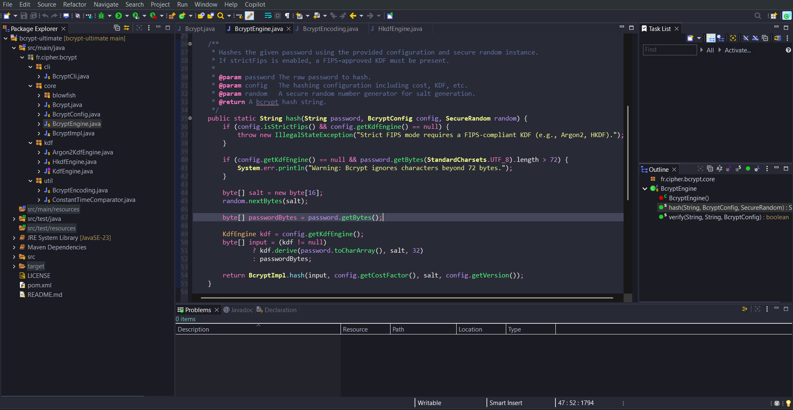
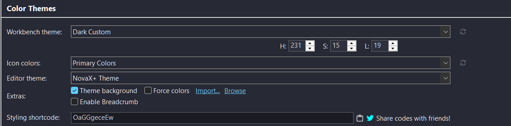

# NovaX Theme for Eclipse  
🎨 A sleek, modern and visually balanced color theme for Eclipse IDE  
By **CipheR_**

NovaX is a dark theme for Eclipse designed for readability, elegance, and focus.  
It enhances the coding experience with carefully selected colors and optimal contrast.

---

## ✨ Preview

### 💻 Editor View (NovaX Theme Active)  

---

## 📥 Installation

1. In Eclipse, open:  
   `Preferences > DevStyle > Color Themes`
2. Click `Import...`
3. Select the provided XML file:  
   👉 `NovaX Theme.xml`
4. Apply the theme

---

## 🎨 Recommended UI Setup (DevStyle)

Go to:  
`Preferences > DevStyle > Color Theme`

Use the following configuration:

---

## 🛠 Author & License

Created with care by **CipheR_**  
License: [MIT](https://opensource.org/licenses/MIT)

---

## 💬 Feedback

Found a bug or have a suggestion?  
Feel free to open an issue or fork and tweak!
